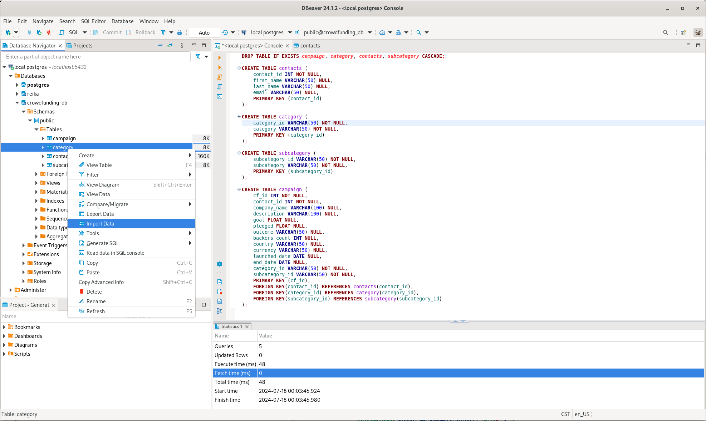
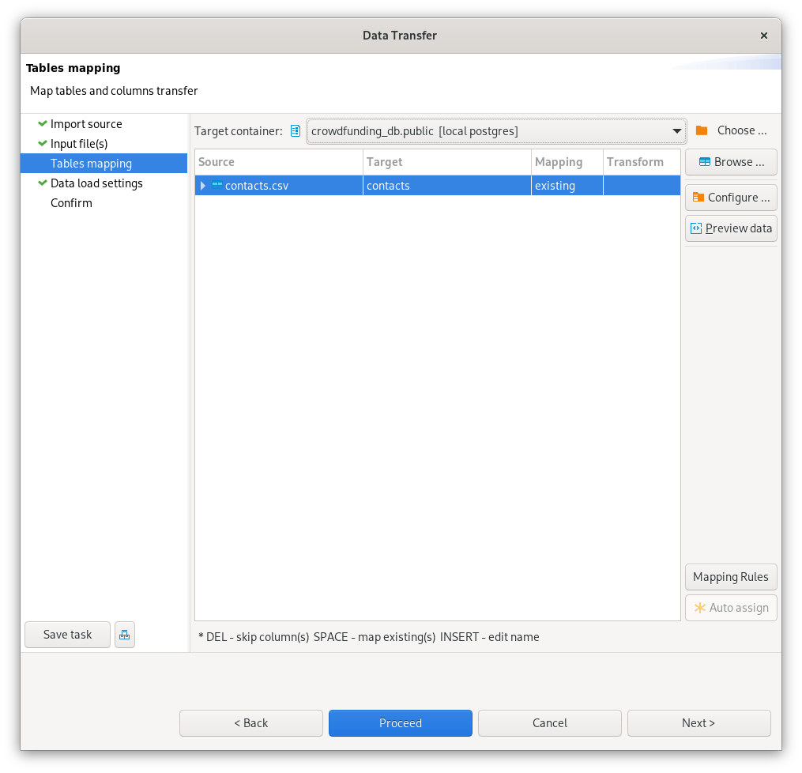

# Crowdfunding ETL Project
ETL mini project, to build an ETL (Extract, Transform, Load) pipeline using Python, Pandas, and either Python dictionary methods or regular expressions. 
The goal is to extract and transform data. Afterward, you’ll create four CSV files and use the data from these files to create an Entity-Relationship Diagram (ERD) and a table schema. Finally, you’ll upload the CSV data into a Postgres database.

## Repository Contents
Here are the links to Jupyter Notebook code, resources, ERD, Schemma, and Screenshots

https://github.com/reikanger/project2/blob/main/ETL_Mini_Project_REikanger_KPandari.ipynb
https://github.com/reikanger/project2/tree/main/Resources
https://github.com/reikanger/project2/blob/main/Campaign%20ERD.png
https://github.com/reikanger/project2/tree/main/Screenshots
https://github.com/reikanger/project2/blob/main/crowdfunding_db_schema.sql

## Database Setup
The project is designed to store data in a PostgreSQL database. Follow these instructions to set up the database tables and import the data contained in the CSV files under the `Resources` folder.

### Step 1 - Create Database Tables

1. Create a new database named `crowdfunding_db` on a PostgreSQL database
2. Run the `crowdfunding_db_schema.sql` script on the `crowdfunding_db` database

### Step 2 - Import CSV Files to Database

1. Once the tables are created by the schema script, import the CSV files under the `Resources` folder in the following order:
    1. contacts.csv
    2. category.csv
    3. subcategory.csv
    4. campaign.csv

#### CSV File Import How-To

Find the tables within the `crowdfunding_db` database. Right click on the table, and select **Import Data**.

In the following screen, select the matching CSV file to import. Select **Proceed** to import the contents of the CSV to the table.

